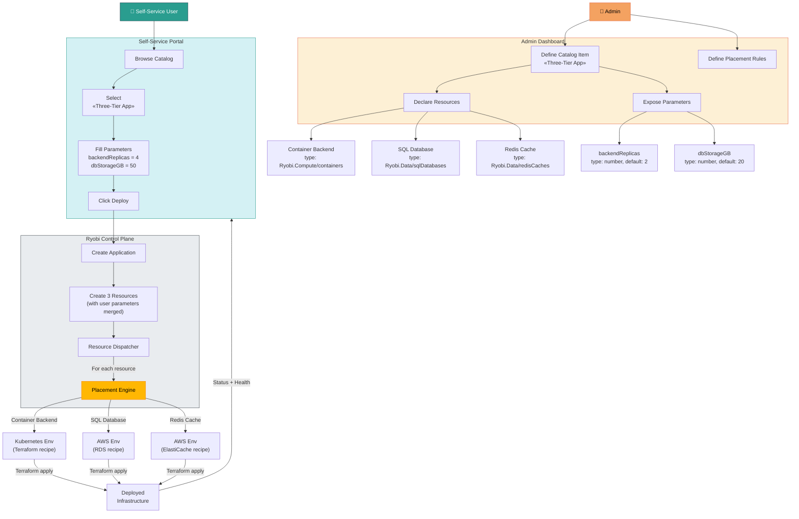
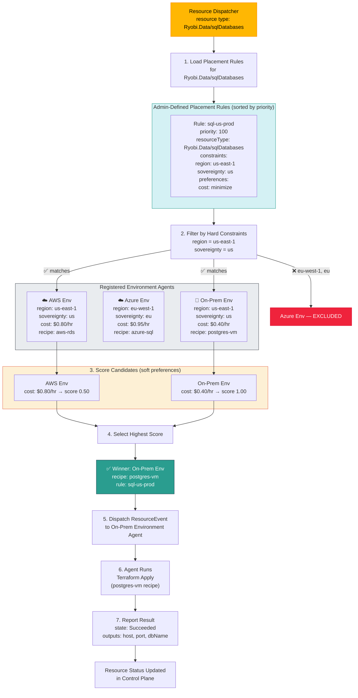

# Ryobi Platform — System Overview

## 1. End-to-End Flow: From Catalog Definition to Deployment

## 2. Provider Selection: How the Placement Engine Picks a SQL Database Provider

## How to Read These Diagrams

### Diagram 1 — End-to-End Flow
1. **Admin** uses the Admin Dashboard to define a **Catalog Item** called "Three-Tier App", declaring three resources (Container Backend, SQL Database, Redis Cache) and exposing user-configurable **parameters** (e.g., `backendReplicas`).
2. **User** opens the Self-Service Portal, browses the catalog, selects the item, fills in parameter values, and clicks **Deploy**.
3. The **Control Plane** creates an Application with three Resources (merging user parameter values into the catalog defaults), then the **Resource Dispatcher** sends each resource to the **Placement Engine**.
4. The Placement Engine selects the best **Environment** (provider) for each resource and dispatches it for Terraform execution.

### Diagram 2 — Provider Selection (SQL Database)
1. Three environments are registered, each advertising support for `Ryobi.Data/sqlDatabases` with different regions, costs, and recipes.
2. The admin has defined a placement rule requiring `region: us-east-1` and `sovereignty: us`, with a preference to **minimize cost**.
3. **Hard constraint filtering** eliminates Azure (wrong region/sovereignty). AWS and On-Prem both pass.
4. **Soft scoring** ranks On-Prem higher because its cost ($0.40/hr) is lower than AWS ($0.80/hr).
5. The On-Prem environment wins. Its agent receives the resource event, runs the `postgres-vm` Terraform recipe, and reports the result back to the control plane.
